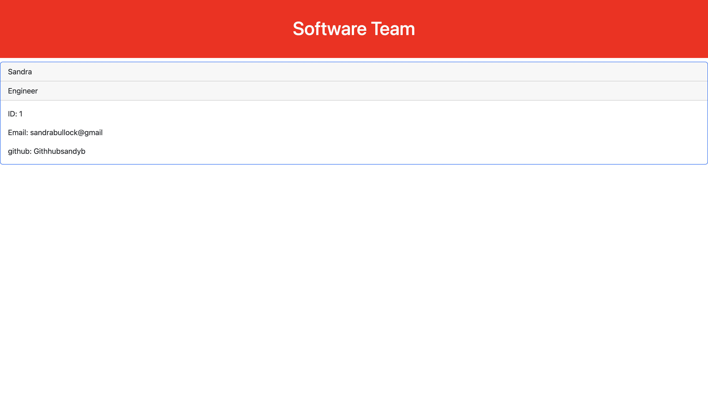

# Team-Generator

Node.js command-line application that takes in information about employees on a software engineering team and generates an HTML webpage 

# Table of Contents

* General Info
* Images
* Website Links
* github

# General Info

Built a Team Generator using the command line, Tested, created and appened the infomration to the index.html file to deploy

# Images

# Website Links
* https://github.com/Ju1Williams/Team-Generator.git
* https://ju1williams.github.io/Team-Generator/

### Github

Ju1Williams